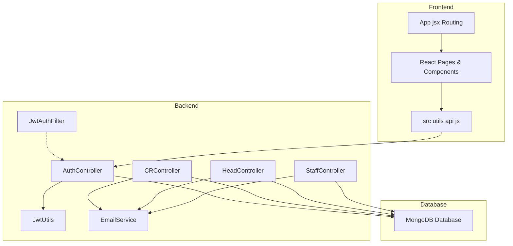

<<<<<<< HEAD
# Documentation

## Project Description  
🎫 **College Community Help Desk System** is an automated ticketing platform that streamlines grievance redressal in a college setting. It combines a **Java Spring Boot** backend for RESTful APIs and a **React.js** frontend with Material UI for an interactive user experience.

## Key Features  
- **6-Tier RBAC:** Separate dashboards for Super-Admin, Department Admin, Department Head, Staff, and CR (Class Representative).  
- **Secure Authentication:** JWT-based login with OTP recovery via Gmail SMTP.  
- **Real-time Notifications:** Automated email alerts on ticket creation, assignment, and resolution.  
- **Interactive Dashboards:** Responsive UI built with Material UI components for seamless task management.  
- **Scalable Backend:** Spring Boot APIs with MongoDB for flexible, NoSQL data storage.  

## Tech Stack  
- Frontend: React.js, Material UI, Axios, React Router  
- Backend: Java, Spring Boot, Spring Security (JWT), Maven  
- Database: MongoDB  
- Communication: Java Mail Sender (Gmail SMTP)  

## Architecture Overview  


## Installation & Setup  

### Prerequisites  
- JDK 17 or higher  
- Node.js v16+  
- MongoDB (local instance or Atlas)  

### Backend Setup  
1. Clone the repository  
   ```bash
   git clone [Your-Repo-Link]
   ```  
2. Navigate to backend  
   ```bash
   cd backend
   ```  
3. Configure `src/main/resources/application.properties`  
   ```properties
   spring.data.mongodb.uri=your_mongodb_uri
   spring.mail.username=your_email@gmail.com
   spring.mail.password=your_app_password
   ```  
4. Run the backend  
   ```bash
   mvn spring-boot:run
   ```  

### Frontend Setup  
1. Navigate to frontend  
   ```bash
   cd frontend
   ```  
2. Install dependencies  
   ```bash
   npm install
   ```  
3. Update API base URL in `src/utils/api.js`  
4. Start the frontend server  
   ```bash
   npm run dev
   ```  

## Security Highlights  
- Passwords are hashed with BCrypt.  
- Stateless JWT authentication secures all API endpoints.  
- Frontend routes are protected to prevent unauthorized access.  

## Contributing  
Contributions are welcome! Please open an issue or submit a pull request to help improve the system.

## Relationships to Code  

| README Section            | Code Location                                | Notes                                     |
|---------------------------|----------------------------------------------|-------------------------------------------|
| RBAC Dashboards           | `Role.java`<br>`@PreAuthorize` in controllers| Defines roles and secures endpoints       |
| JWT Authentication        | `AuthController.java`<br>`JwtUtils.java`     | Login, token generation, token validation |
| OTP Recovery              | `/api/auth/forgot-password`, `/reset-password` | OTP generation and validation via email   |
| Notifications             | `EmailService.java`                          | Sends emails on ticket events            |
| REST APIs                 | Controllers (e.g., `CRController.java`)      | CRUD operations and workflows             |
| Interactive UI            | `frontend/src/pages/*.jsx`                   | React pages for each user role           |
| Database Config           | `application.properties`                     | MongoDB connection parameters             |
| HTTP Client               | `frontend/src/utils/api.js`                  | Axios instance for API calls             |

## Key Files Reference  

| File                            | Path                                                          | Responsibility                                      |
|---------------------------------|---------------------------------------------------------------|-----------------------------------------------------|
| Role enum                       | `backend/.../model/Role.java`                                 | Defines user roles                                  |
| Security configuration          | `backend/.../config/SecurityConfig.java`                      | JWT filter, CORS, session policy                    |
| Auth controller                 | `backend/.../controller/AuthController.java`                  | User registration, login, OTP                     |
| Ticket management controllers   | `backend/.../controller/*Controller.java`                     | CRController, HeadController, StaffController       |
| Email service                   | `backend/.../service/EmailService.java`                       | Sends all notification emails                       |
| JWT utilities                   | `backend/.../utils/JwtUtils.java`                             | Token creation and validation                       |
| React routing                   | `frontend/src/App.jsx`                                        | Defines client-side routes                          |
| API client                      | `frontend/src/utils/api.js`                                   | Axios setup for API communication                   |
| React pages per role            | `frontend/src/pages/*.jsx`                                    | Dashboards and forms for each user role             |

This documentation maps the high-level guidance in `README.md` to concrete code components, helping you understand how each feature is implemented across frontend and backend.
=======
# React + Vite

This template provides a minimal setup to get React working in Vite with HMR and some ESLint rules.

Currently, two official plugins are available:

- [@vitejs/plugin-react](https://github.com/vitejs/vite-plugin-react/blob/main/packages/plugin-react) uses [Babel](https://babeljs.io/) for Fast Refresh
- [@vitejs/plugin-react-swc](https://github.com/vitejs/vite-plugin-react/blob/main/packages/plugin-react-swc) uses [SWC](https://swc.rs/) for Fast Refresh

## Expanding the ESLint configuration

If you are developing a production application, we recommend using TypeScript with type-aware lint rules enabled. Check out the [TS template](https://github.com/vitejs/vite/tree/main/packages/create-vite/template-react-ts) for information on how to integrate TypeScript and [`typescript-eslint`](https://typescript-eslint.io) in your project.
>>>>>>> dc1a06c (feat: initial commit)
